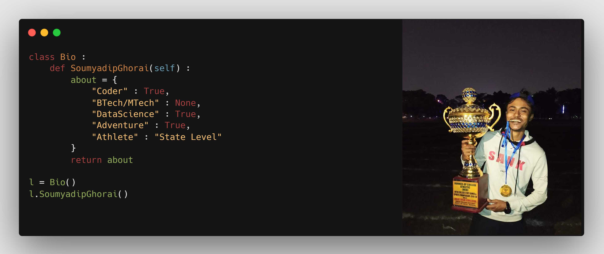

<h1 align="center">Hi folks 👋, I'm Soumyadip Ghorai</h1>
<h3 align="center">A passionate Data Scientist and a vivid traveler from India</h3>

    

  

- 🔭 I’m currently working on **My basics**

- 🌱 I’m currently learning **Machine learning and deep learning**

- 👯 I’m looking to collaborate on **Machine learning projects**

- 💬 Ask me about **the adventures I had, kidding XD!**

- 📫 How to reach me **ghorai.soumyadip33@gmail.com**

- ⚡ Fun fact **If you go on a trek with me you'll come back safely**

<h3 align="left">Connect with me:</h3>

<h3 align="left">I'm also active on :</h3>

<h3 align="left">I'm most comfortable in:</h3>
 </a> <a href="https://scikit-learn.org/" target="_blank"> <a href="https://www.python.org" target="_blank"> 
<h3 align='left'> I build my websites using : </h3>

   

    
<h3 align='left'> I'm new to : </h3>

 
       </a>

&nbsp;

